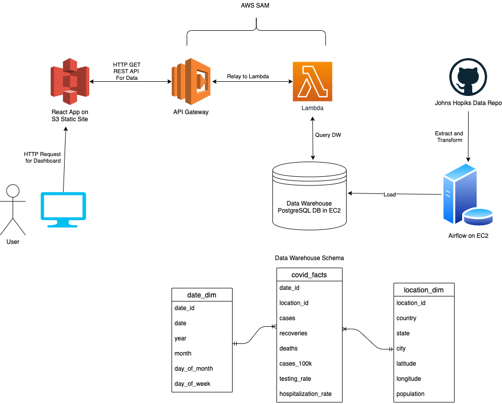

# covid-trend-miner

## Architectural Diagram



## REST API Specs

### Country

__Fetching Available Countries__

```
GET: /countries
```

Output

```
[
  { name: str, latitude: float, longitude: float },
  ...
]
```

__Fetch Data By Country__

```
GET: /countries/{country_id}/
```

Output

```
{
	name: string,
	totalDeaths: int,
	totalCases: int,
	totalRecovered: int,
	dailyData: [
		{
		  date: ISO string,
		  newCases: int,
		  newDeaths: int,
		  newRecoveries: int,
		  hospitalizations: int,
		  tests: int,
		  positivityRate: float
		},
	]
}
```

### State

__Fetch Available States / Provinces__

```
GET /states
```

Output

```
[
  {
    name: str,
    country: str,
    latitude: float,
    longitude: float
  },
  ...
]
```

__Fetch Data By State__

```
GET /states/{state_id}/
```

Output

```
{
	name: string,
	totalDeaths: int,
	totalCases: int,
	totalRecovered: int,
	dailyData: [
		{
		  date: ISO string,
		  newCases: int,
		  newDeaths: int,
		  newRecoveries: int,
		  hospitalizations: int,
		  tests: int,
		  positivityRate: float
		},
	]
}
```

### City

__Fetch Available Cities__

```
GET: /cities/
```

Output

```
[
  {
    name: str,
    state: str,
    country: str,
    latitude: float,
    longitude: float
  },
  ...
]
```

__Fetch By City__

```
GET /cities/{city_id}
```

Output

```
{
	name: string,
	totalDeaths: int,
	totalCases: int,
	totalRecovered: int,
	dailyData: [
		{
		  date: ISO string,
		  newCases: int,
		  newDeaths: int,
		  newRecoveries: int,
		  hospitalizations: int,
		  tests: int,
		  positivityRate: float
		},
	]
}
```

## References and Links

Example SAM App: https://thecodinginterface.com/blog/aws-sam-serverless-rest-api-with-flask/

React App Example: https://github.com/amcquistan/tci-react-lol

AWS SAM: https://docs.aws.amazon.com/serverless-application-model/index.html

Apache Airflow: https://airflow.apache.org/

Flask: https://flask.palletsprojects.com/en/1.1.x/

Star Schema: https://en.wikipedia.org/wiki/Star_schema

