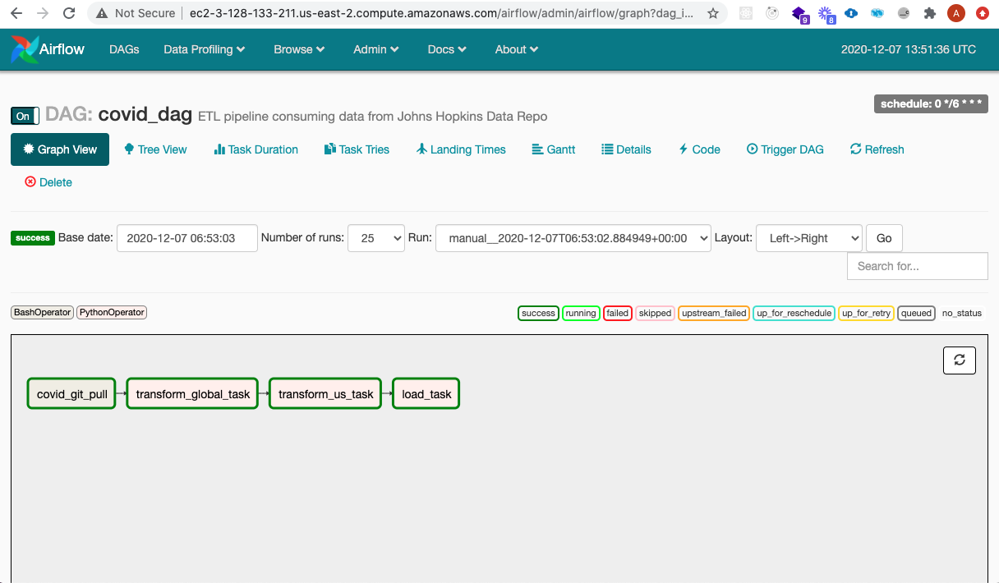
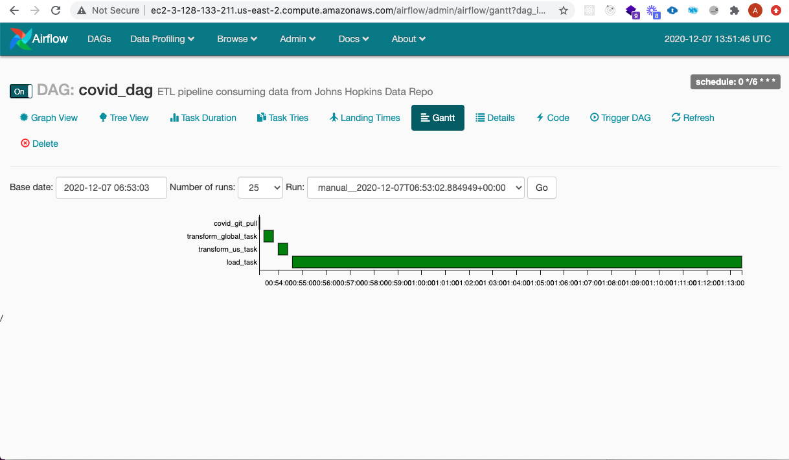

# Apache Airflow ETL Pipeline

This directory contain the Airflow DAGs and associated code for ETL along with the scripts needed to provision a Air Flow installation on a Linux EC2 instance

## AirFlow ETL Pipeline Details

The ETL pipeline take data in the form of flat (aka, csv) files in the John's Hopkins GitHub data repo, transforms them to a consistent format and, loads them into a Data Warehouse on a PostgreSQL database.

#### [AirFlow Instance](http://ec2-3-128-133-211.us-east-2.compute.amazonaws.com/airflow/)

### CloudFormation Automation

CloudFormation is being used for IaC and there exists the following scripts to manage the creation, status check and deletion of CloudFormation stacks.

- [create-stack.sh](./create-stack.sh)
- [describe-stack.sh](./describe-stack.sh)
- [delete-stack.sh](./delete-stack.sh)

To run these scritps the following environment variables are required.

- `COVID_AWS_PROFILE` 
  - profile associated with your local AWS CLI linking to the AWS Account you want to deloy to

- `COVID_AWS_REGION`
  - the region in AWS Account that you want the CloudFormation stack created in

- `COVID_AWS_EC2_KEYPAIR`
  - The AWS Key Pair Name you want to be used for accessing the EC2 instance

- `COVID_AWS_CF_STACKNAME`
  - The CloudFormation Stack name for the AirFlow and Postgres EC2 instance

